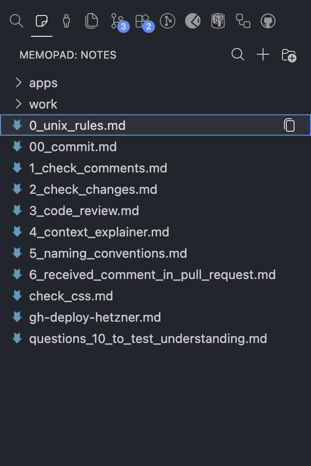

# memopad

Notes where you code.

No new window. No context switch. No friction. Your notes live in the VS Code sidebar, one click from your cursor.



## The Problem

Every note app pulls you out of flow. Notion, Obsidian, Apple Notes—separate windows, separate headspace. By the time you find what you need, you've lost your thread.

## The Solution

memopad keeps your notes in peripheral vision. Open. Copy. Paste. Back to coding in two seconds.

AI prompts you reuse. SQL queries you forget. That regex. Standup notes. All of it, right there.

## Plain Text. Your Rules.

```
~/.memopad/
  prompts/
    code-review.md
    explain-this.md
  work/
    meeting-notes.md
```

No database. No cloud. No lock-in. Regular files you can grep, backup, git, or sync however you want.

## Get Started

1. Click the memopad icon in the activity bar
2. Create notes and folders with `+`
3. Drag to organize
4. Right-click for more

## License

MIT
